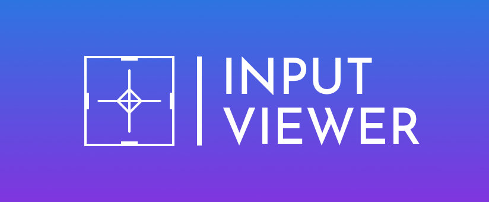
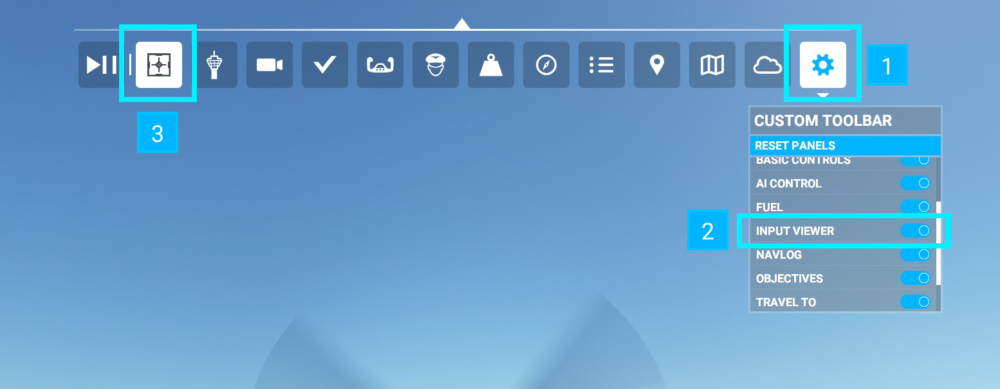

# Input Viewer - In-Game Panel addon for MSFS2020

Do you want to inspect your controls without looking at internal 3D models like throttle levers? Or, you want to brag about how good you are at controlling aircraft in your recording videos? Well, here is an easy solution!

This tiny addon adds an in-game panel that shows several axis inputs for MSFS.

As some of you may know, this is a rip-off of **Controls Indicator** feature from DCS (Digital Combat Simulator). Perhaps, other flight sims might have a similar feature.

This input viewer covers the following input axes:

- Aileron input/trim position
- Elevator input/trim position
- Rudder input/trim position
- Wheel brakes
- Throttle #1/2/3/4
- Propeller RPM #1
- Mixture #1

Prop RPM #2-4 and Mixture #2-4 are not included.

## Installation

Copy `spitice-ingamepanels-inputviewer` folder to community package folder.

If you wonder what the community package folder is, googling for "msfs community package directory" might help.

To uninstall, simply remove `spitice-ingamepanels-inputviewer` from your community package folder.

## Usage

You should find a custom panel icon in your in-game toolbar. Click it to activate the panel.

If it doesn't appear, access the list of in-game panels by clicking the gear icon, then toggle "INPUT VIEWER" on. It should add the panel icon to your toolbar.

The initial position of the panel might be the top right of your screen. Drag the header and the border to move and resize the panel as you want.

By default, the throttle panel only shows the throttle axes. To enable Propeller RPM and Mixture axis, click the toggle switch located at the bottom left.

## Repository

Feel free to fork it and try to make your own input viewer. Any bug reports and suggestions are also welcome :)

https://github.com/spitice/msfs-input-viewer

## Acknowledgements

- [msfs2020-toolbar-window-template](https://github.com/bymaximus/msfs2020-toolbar-window-template) helped me a lot to kick off this project.
- [msfs-webui-devkit](https://github.com/dga711/msfs-webui-devkit) makes developing a custom UI easier.
